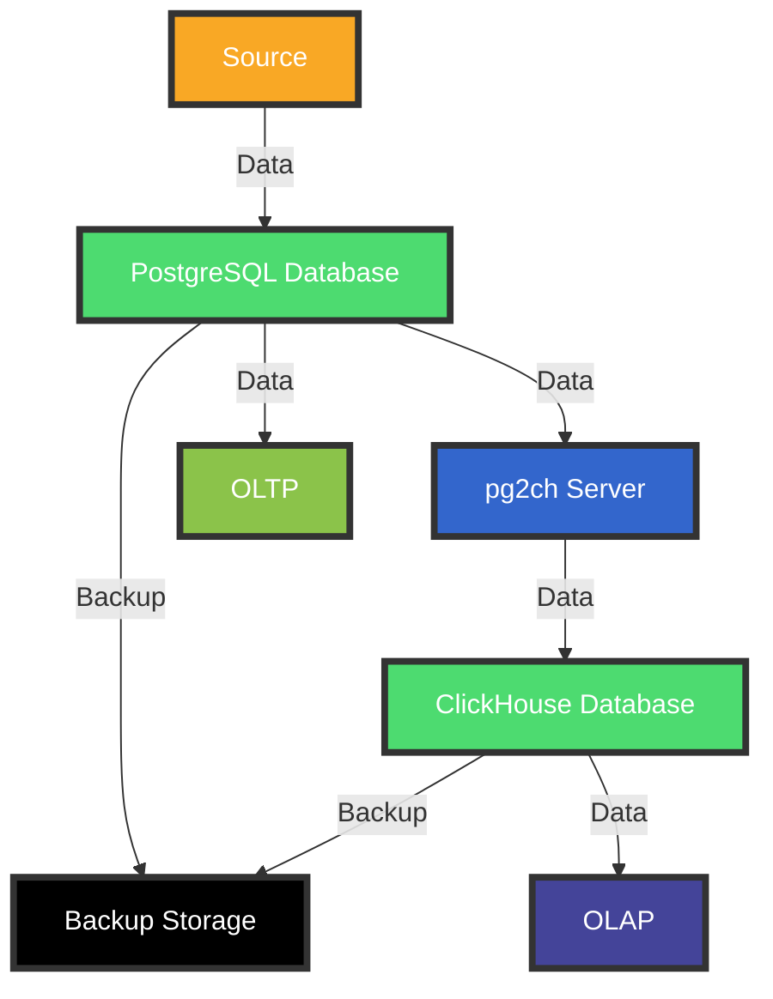

# Migrate data from Postgres to ClickHouse for analytic services

## Initial setup

### 1. Got fresh Ubuntu 20.04 LTS box
### 2. Installing PostgreSQL 

```bash
sudo apt update
sudo apt install postgresql postgresql-contrib
sudo systemctl start postgresql.service
sudo systemctl status postgresql.service
```

### 3. Setup PostgreSQL

```bash
sudo -u postgres createuser --interactive
Enter name of role to add: `pg2ch`
Shall the new role be a superuser? (y/n) `y`

sudo -u postgres createdb pg2ch
```

```bash
sudo adduser pg2ch
```

In a file `/etc/postgresql/14/main/postgresql.conf`:
- set `wal_level` to `logical`
- set `max_replication_slots` to at least `2`
`sudo systemctl restart postgresql.service`
`sudo systemctl status postgresql.service`


### 4. Setup ClickHouse
- Install ClickHouse
```bash
sudo apt-key adv --keyserver keyserver.ubuntu.com --recv E0C56BD4
echo "deb http://repo.yandex.ru/clickhouse/deb/stable/ main/" | sudo tee /etc/apt/sources.list.d/clickhouse.list
sudo apt update
sudo apt install clickhouse-server clickhouse-client
sudo service clickhouse-server start
sudo service clickhouse-server status
```

- Connect to ClickHouse client
```bash
clickhouse-client --password
```
- Create database
```bash
CREATE DATABASE pg2ch;
USE pg2ch;
```

### 5. Prepare migration data using benchmark

```bash
sudo -u pg2ch pgbench -i
```

### 6. Change replica identity for the `pgbench_accounts` table to FULL, so that we'll receive old values of the updated rows
```sql
ALTER TABLE pgbench_accounts REPLICA IDENTITY FULL;
```

### 7. Create PostgreSQL publication for the `pgbench_accounts` table

```sql
CREATE PUBLICATION pg2ch_pub FOR TABLE pgbench_accounts;
```

### 8. Create PostgreSQL logical replication slot

```sql
SELECT * FROM pg_create_logical_replication_slot('pg2ch_slot', 'pgoutput');
```

### 9. Create tables on the ClickHouse side
- our target table
    ```sql
    CREATE TABLE pgbench_accounts (aid Int32, abalance Int32, sign Int8) ENGINE = CollapsingMergeTree(sign) ORDER BY aid
    ```
- table that will be used as a buffer table
    ```sql
    CREATE TABLE pgbench_accounts_buf (aid Int32, abalance Int32, sign Int8, row_id UInt64) ENGINE = Memory()
    ```
### 10. Clone PG2CH

    !!! IMPORTANT !!!

Original work of [mkabilov](https://github.com/mkabilov/pg2ch) unfortunalely is not compatible with Golang version 1.13+ due to usage of Go Deps instead of Go Modules 

In order to preserve such an amazing tool [mattTruebill](https://github.com/mattTruebill/pg2ch) performed migration to Go Modules and for some reason [his PR](https://github.com/mkabilov/pg2ch/pull/36) hasn't been acceepted since 02/02/2021

This is why i merged changes into the master branch of my fork: https://github.com/root-itosai/pg2ch

```bash
git clone https://github.com/root-itosai/pg2ch
cd pg2ch
```

Create `config.yaml` file with the following content (replace YOUR_CLICKHOUSE_PASSWORD with your actual ClickHouse password):
```yaml
tables:
    pgbench_accounts:
        main_table: pgbench_accounts
        buffer_table: pgbench_accounts_buf
        buffer_row_id: row_id
        engine: CollapsingMergeTree
        max_buffer_length: 1000
        merge_threshold: 4
        columns:
            aid: aid
            abalance: abalance
        sign_column: sign

inactivity_merge_timeout: '10s'

clickhouse:
    host: localhost
    port: 9000
    database: default
    username: default
    passwird: YOUR_CLICKHOUSE_PASSWORD
postgres:
    host: localhost
    port: 5432
    database: pg2ch
    user: pg2ch
    replication_slot_name: pg2ch_slot
    publication_name: pg2ch_pub
    
db_path: db
```

### 10. Build PG2CH

```bash
go build
```

### Run PG2CH

```bash
./pg2ch --config config.yaml
```

## TODOs:
- Profile the code to find bottlenecks
- Make sure no memory leask occur
- Troubleshoot LSNs issue

## Proposed solution schema:



### Explainaiton:

- Source generates data entry in our Postgres
- Postgres generates publication that is being monitored by PG2CH service
- PG2CH writes data to ClickHouse in optimized manner
- In case if we need OLTP access to data we use Postgres
- In case if we need OLAP access to data we use ClickHouse